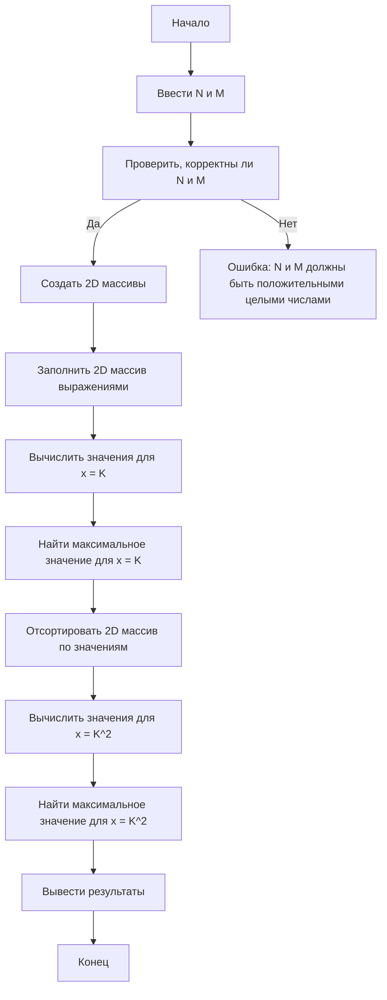

## Отчет по лабораторной работе № 2

#### № группы: `ПМ-2401`

#### Выполнил: `Худяков Матвей Иванович`

#### Вариант: `28`

### Cодержание:

- [Постановка задачи](#1-постановка-задачи)
- [Входные и выходные данные](#2-входные-и-выходные-данные)
- [Выбор структуры данных](#3-выбор-структуры-данных)
- [Алгоритм](#4-алгоритм)
- [Программа](#5-программа)
- [Анализ правильности решения](#6-анализ-правильности-решения)

### 1. Постановка задачи
- Условие задачи
>Напишите программу на Java, которая выполняет следующие действия с
>двумерным массивом строк, представляющих математические выражения:
>1. Считывает с консоли размеры массива N и M, затем элементы
>массива размером N×M (например, «3x+2», т.е. в формате “ax+b”,
>где a и b — цифры). Затем считывает число K.
>2. Для заданного значения x = K вычисляет и выводит результат
>каждого выражения в массиве.
>3. Сортирует строки массива по возрастанию результата выражения
>при данном x. Если результаты равны, сортирует по длине строки.
>4. Выводит элементы массива, заменяя переменную x на её квадрат
>и выводит новые результаты.
>5. Находит и выводит выражение с максимальным результатом при
>данном x.
- Что нужно сделать
>Считать размеры массива и создать массив, затем его элементы, затем значение `K`.
>Для каждого элемента массива найти значение от `K` и вывести его на экран.
>Сортировка массива по неубыванию по результатам подстановки `K`.
>Подставить вместо `K` -> `K^2` и вывести результаты на экран.
>Найти и вывести выражение с максимальным результатом.


### 2. Входные и выходные данные

#### Данные на вход
На вход программа должна получать `N*M` выпажений вида `Ax+B`, где A, B - цифры. Также получает `K`.

|             | Тип         | min значение  | max значение     |
|-------------|-------------|---------------|------------------|
| N           | Цифра       |      0        |        9         |
| M           | Цифра       |      0        |        9         |
| K           | Целое число |-2<sup>63</sup>| 2<sup>63</sup>-1 |

#### Данные на выход

Программа выводит следующие `важные` строки:
1. N*M строк со значениями выражений от `x = K`.
2. N*M строк со значениями выражений от `x = K^2`.
3. Выражение с наибольшим значением от `x = K` и `x = K^2`

|          | Тип    |
|----------|--------|
| Строка 1 | Строка |

### 3. Выбор структуры данных

Все переменные и их назначения:
int `N` — длина массива.
int `M` — высота массива.
int `i` — индекс для строк.
int `j` — индекс для столбцов.
int `K` — значение для x.
int `maxFirst` — максимальное значение при x = K.
int `temp` — временная переменная для обмена значениями.
int `c` — переменная для отслеживания количества отстортированных элементов.
int `maxSquare` — максимальное значение при x = K^2.
int `K2` — значение K в квадрате.
int `result` — результат вычисления для текущего выражения.
int `resInd` — индекс строки с максимальным значением при x = K^2.
int `resJnd` — индекс столбца с максимальным значением при x = K^2.

Массивы:
String[][] `firstArray` — двумерный массив строк для хранения введённых выражений.
int[][] `secondArray` — двумерный массив целых чисел для хранения вычисленных значений выражений.

Другие переменные:
boolean `replaceQ` — показывает была ли перестановка.
String `exsp` — строка для хранения введённого выражения.
String `maxFirstS` — строка для хранения выражения, соответствующего максимальному значению при x = K.
String `Temp` — временная строка для обмена значениями в массиве строк.

### 4. Алгоритм

#### Алгоритм выполнения программы:

1. **Ввод данных:**  
   Программа считывает 2 натуральных числа `N` и `M`, создает двумерный массив (только если числа натуральные), затем считывает N*M элементов вида `Ax+B`, где A и B - цифры (проверяет, чтобы элементы соответствовали виду Ax+B), и после этого считывает `K` - значение для x (целое число).

2. **Создание и заполение массива secondArray:**  
   `secondArray` заполняется значениями выражений из массива `firstArray`, а так же сразу ищет максимальное значение выражения от x (ложит его в переменную `maxFirst`, а сам элемент в переменную `maxFirstS`).

3. **Сортировка строк по неубыванию:**  
   Сравнивает элементы строк и путём "перестановок" сортирует элементы строк `firstArray` в порядке неубывания, так же соритировка при одинакаковых значениях элементов зависит от коэфицента у x (Пример: 4x+4 и 6x+0 при x = 2 будут отсортированы так, что сначала идёт 4x+4, а затем 6x+0).

4. **Вывод остортированных элементов от x = K<sup>2</sup>**
   Вместо x подставляем `K^2` и выводим получившиеся результаты на экран.

5. **Вывод наибольших значений от x = K и x = K<sup>2</sup>:**  
   Выводит максимальные значения и сами элементы от соответствующих значений x.

#### Блок-схема



### 5. Программа


```java
import java.io.IOException;
import java.io.PrintStream;
import java.util.Scanner;
public class Lab22 {
    // Объявляем объект класса Scanner для ввода данных
    public static Scanner in = new Scanner(System.in);
     // Объявляем объект класса PrintStream для вывода данных
    public static PrintStream out = System.out;
    public static void main(String[] args) throws IOException {
        out.println("Введите размеры массива");
        out.print("Длина N: ");
        int N = in.nextInt(); // Ввод длины строки
        out.print("Высота M: "); 
        int M = in.nextInt(); // Ввод количества строк
        if (M >= 1 && N >= 1) { // Проверка значений N и M
            String[][] firstArray = new String[N][M]; // создание двумерного массива
            firstArray[N-1][M-1] = "0"; // Задаю последний элемент для удобства
            int i = 0; int j = 0; // индексы
            String exsp; // Переменная для элементов массива
            out.println("Заполнение массива:");
            // Заполниение массива
            while (firstArray[N-1][M-1] == "0") {
                exsp = in.nextLine(); // Ввод элемента
                // Проверка элемента
                if (exsp.length() == 4 && exsp.charAt(0) >= '0' && exsp.charAt(0) <= '9' && exsp.charAt(3) >= '0' && exsp.charAt(3) <= '9' && exsp.charAt(1) == 'x' && exsp.charAt(2) == '+') {
                    // Добавление эл-та в массив и увеличение индексов
                    firstArray[i][j] = exsp;
                    i++;
                    if (i == N) {
                        i = 0; j++;
                    }
                }
                else {
                    // Пишет если элемент не удовлетворяет шалону
                    out.println("Выражения должны иметь вид 'Ax+B', где A и B - цифры!");
                }
            }
            out.print("Введите число K для x: ");
            int K = in.nextInt(); // Ввод числа K
            int maxFirst = 0; String maxFirstS = ""; // Переменные для хранения максимального элемента от K
            int[][] secondArray = new int[N][M]; // Новый двумерный массив со значениями выражений от K
            for (j = 0; j < M; j++) {
                for (i = 0; i < N; i++) {
                    // Если элемент первый, то он автоматически максимальный
                    if (j == 0 && i == 0) {
                        maxFirst = (firstArray[i][j].charAt(0)-'0')*K+firstArray[i][j].charAt(3)-'0';
                    }
                    // Считаем значение выражения от K
                    secondArray[i][j] = (firstArray[i][j].charAt(0)-'0')*K+firstArray[i][j].charAt(3)-'0';
                    // Ищем максимальный элемент
                    if (secondArray[i][j] > maxFirst) {
                        maxFirst = secondArray[i][j]; maxFirstS = firstArray[i][j];
                    }
                    // Выводим на экран значения выражний от K
                    out.print(firstArray[i][j].charAt(0)+"*"+K+"+"+firstArray[i][j].charAt(3)+" = "+secondArray[i][j]+"   ");
                }
                out.println();
            }
            // Переменные для сортировки элементов по строкам, по их значению от K
            int temp = 0; String Temp = ""; boolean replaceQ = false; int c = 1;
            for (j = 0; j < M; j++) {
                c = 1; // сбрасываем количество отсортированных эл-ов
                do {
                    replaceQ = false; // Сбрасываем информацию о том что были перестановки
                    for (i = 0; i < N-c; i++) {
                        // Пузырёк с доп. условием
                        if (secondArray[i][j] >= secondArray[i+1][j]) {
                            // Переставляем элементы второго массива
                            temp = secondArray[i][j];
                            secondArray[i][j] = secondArray[i+1][j];
                            secondArray[i+1][j] = temp;
                            // Доп. условие: если значения элементов равны, но коэфицент при x у кого-то из них больше, то с большим коэфицентом ставим вперёд
                            if (secondArray[i][j] == secondArray[i+1][j]) {
                                if (firstArray[i][j].charAt(0) > firstArray[i+1][j].charAt(0)) {
                                    Temp = firstArray[i][j];
                                    firstArray[i][j] = firstArray[i+1][j];
                                    firstArray[i+1][j] = Temp;                               
                                }
                            }
                            else { // Иначе просто переставляем элементы первого массива
                                Temp = firstArray[i][j];
                                firstArray[i][j] = firstArray[i+1][j];
                                firstArray[i+1][j] = Temp;    
                            }
                            // Устанавливаем значение что перестановка была совершена
                            replaceQ = true;
                        }    
                    }
                    // уменьшаем количество сравниваемых перменных
                    c++;
                } while (replaceQ == true);
            }
            // Переменные для поиска максимального значения элемента от K^2
            int maxSquare = 0;
            int K2 = K*K; int result = 0; int resInd = 0; int resJnd = 0;
            out.println("Теперь строки отсортированы в порядке возрастания значений от x = K = "+K+", и мы можем вывести их значения в этом порядке от x = K^2 = "+K2);
            // Ищем максимальный элемент и выводим значения выражений от K^2
            for (j = 0; j < M; j++) {
                for (i = 0; i < N; i++) {
                    result = (firstArray[i][j].charAt(0)-'0')*K2+firstArray[i][j].charAt(3)-'0';
                    if (j == 0 && i == 0) // если элемент первый, то автоматически максимальный
                        maxSquare = result;
                    // Ищем максимальный элемент и индексы для нахождения самого выражения
                    if (result > maxSquare) {
                        maxSquare = result;
                        resInd = i;
                        resJnd = j;
                    }
                // Вывод значений выражений на экран
                out.print(firstArray[i][j].charAt(0)+"*"+K2+"+"+firstArray[i][j].charAt(3)+" = "+result + "   ");
                }
                out.println();
            }
            //Вывод максимального значения при x = K и x = K^2
            out.println("Наибольшее значение выражения при x = K = "+K+" - это:\n"+maxFirstS.charAt(0)+"*"+K+"+"+maxFirstS.charAt(3)+" = "+maxFirst);
            out.println("Наибольшее значение выражения при x = K^2 = "+K2+" - это:\n"+firstArray[resInd][resJnd].charAt(0)+"*"+K2+"+"+firstArray[resInd][resJnd].charAt(3)+" = "+maxSquare);
        }
        else {
            // Если N и M не удовлетворяют условию
            out.print("N и M - целые числа больше 0!");
        }
    }
}
```

### 6. Анализ правильности решения

Данные тесты были выбраны потому что они охватывают все возможные сценарии работы программы

1. Тест для `не наутральных N и M`:

    - **Input**:
        ```
        -1 1
        ```

    - **Output**:
        ```
        N и M - целые числа больше 0!
        ```

2. Произвольный пример:

    - **Input**:
        ```
        Введите размеры массива
        Длина N: 2
        Высота M: 2
        Заполнение массива:
        Выражения должны иметь вид 'Ax+B', где A и B - цифры!
        0x+9
        1x+0 
        2x+5 
        3x+3 
        Введите число K для x: 4
        ```

    - **Output**:
        ```
        0*4+9 = 9   1*4+0 = 4   
        2*4+5 = 13   3*4+3 = 15
        Теперь строки отсортированы в порядке возрастания значений от x = K = 4, и мы можем вывести их значения в этом порядке от x = K^2 = 16
        1*16+0 = 16   0*16+9 = 9   
        2*16+5 = 37   3*16+3 = 51
        Наибольшее значение выражения при x = K = 4 - это:
        3*4+3 = 15
        Наибольшее значение выражения при x = K^2 = 16 - это:
        3*16+3 = 51
        ```

3. Произвольный пример:

    - **Input**:
        ```
        Введите размеры массива
        Длина N: 3
        Высота M: 4
        Заполнение массива:
        Выражения должны иметь вид 'Ax+B', где A и B - цифры!
        2x+1
        2x+1
        3x+0
        7x+8
        3x+8
        4x+5
        5x+1
        1x+0
        2x+9
        1x+6
        3x+7
        2x+3
        Введите число K для x: 1
        ```

    - **Output**:
        ```
        2*1+1 = 3   2*1+1 = 3   3*1+0 = 3   
        7*1+8 = 15   3*1+8 = 11   4*1+5 = 9
        5*1+1 = 6   1*1+0 = 1   2*1+9 = 11
        1*1+6 = 7   3*1+7 = 10   2*1+3 = 5
        Теперь строки отсортированы в порядке возрастания значений от x = K = 1, и мы можем вывести их значения в этом порядке от x = K^2 = 1
        2*1+1 = 3   2*1+1 = 3   3*1+0 = 3   
        4*1+5 = 9   3*1+8 = 11   7*1+8 = 15
        1*1+0 = 1   5*1+1 = 6   2*1+9 = 11
        2*1+3 = 5   1*1+6 = 7   3*1+7 = 10
        Наибольшее значение выражения при x = K = 1 - это:
        7*1+8 = 15
        Наибольшее значение выражения при x = K^2 = 1 - это:
        7*1+8 = 15
        ```

4. Тест: элемент не соответсвует шаблону:

    -**Работа программы**
    ```
    Введите размеры массива
    Длина N: 3
    Высота M: 1
    Заполнение массива:
    Выражения должны иметь вид 'Ax+B', где A и B - цифры!
    2ф+1
    Выражения должны иметь вид 'Ax+B', где A и B - цифры!
    2x+0
    0x+0
    10x+1
    Выражения должны иметь вид 'Ax+B', где A и B - цифры!
    9x-1
    Выражения должны иметь вид 'Ax+B', где A и B - цифры!
    2x+99
    Выражения должны иметь вид 'Ax+B', где A и B - цифры!
    2x+9
    Введите число K для x: 5
    2*5+0 = 10   0*5+0 = 0   2*5+9 = 19   
    Теперь строки отсортированы в порядке возрастания значений от x = K = 5, и мы можем вывести их значения в этом порядке от x = K^2 = 25
    0*25+0 = 0   2*25+0 = 50   2*25+9 = 59   
    Наибольшее значение выражения при x = K = 5 - это:
    2*5+9 = 19
    Наибольшее значение выражения при x = K^2 = 25 - это:
    2*25+9 = 59
    ```

5. Тест: K < 0:
    ```
    Введите размеры массива
    Длина N: 2
    Высота M: 3
    Заполнение массива:
    Выражения должны иметь вид 'Ax+B', где A и B - цифры!
    2x+3
    3x+3
    5x+1
    4x+2
    6x+0
    4x+4
    Введите число K для x: 2
    2*2+3 = 7   3*2+3 = 9   
    5*2+1 = 11   4*2+2 = 10
    6*2+0 = 12   4*2+4 = 12
    Теперь строки отсортированы в порядке возрастания значений от x = K = 2, и мы можем вывести их значения в этом порядке от x = K^2 = 4
    2*4+3 = 11   3*4+3 = 15
    4*4+2 = 18   5*4+1 = 21
    4*4+4 = 20   6*4+0 = 24
    Наибольшее значение выражения при x = K = 2 - это:
    6*2+0 = 12
    Наибольшее значение выражения при x = K^2 = 4 - это:
    6*4+0 = 24
    ```